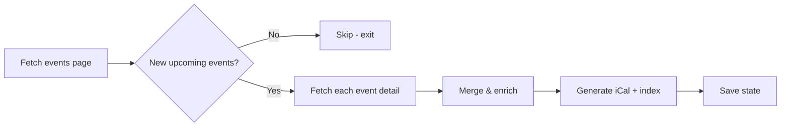

<p align="center">
  <strong>🚗 Tesla Owners UK Events Calendar</strong>
</p>
<p align="center">
  <em>iCalendar feed for Tesla Owners UK events — track days, meetups, AGMs and more</em>
</p>

<p align="center">
  <a href="https://github.com/evenwebb/tesla-owners-club-uk-events-calendar/blob/main/LICENSE"></a>
  <a href="https://www.python.org/downloads/"></a>
  <a href="https://github.com/evenwebb/tesla-owners-club-uk-events-calendar"></a>
</p>

<p align="center">
  <a href="https://evenwebb.github.io/tesla-owners-club-uk-events-calendar/"><strong>📅 Subscribe to the calendar →</strong></a>
</p>

> **Just want the events?** Visit the link above to add Tesla Owners UK events to Google Calendar, Apple Calendar, or Outlook. No code required — one click to subscribe.

---

## 📋 Table of Contents

- [Subscribe (no code)](#-subscribe-to-the-calendar)
- [Quick Start](#-quick-start)
- [Features](#-features)
- [Installation](#-installation)
- [Usage](#-usage)
- [GitHub Actions](#-github-actions)
- [Configuration](#-configuration)
- [How It Works](#-how-it-works)
- [Example Output](#-example-output)
- [License & Disclaimer](#-license--disclaimer)

---

## 📅 Subscribe to the Calendar

**Add Tesla Owners UK events to your calendar — no installation, no code.**

| Calendar | How to add |
|----------|------------|
| **Google Calendar** | [Open the calendar page](https://evenwebb.github.io/tesla-owners-club-uk-events-calendar/), click **Subscribe to calendar**, or add via *Add other calendars → From URL* |
| **Apple Calendar** | [Open the calendar page](https://evenwebb.github.io/tesla-owners-club-uk-events-calendar/), click the link, or use *File → New Calendar Subscription* |
| **Outlook** | [Open the calendar page](https://evenwebb.github.io/tesla-owners-club-uk-events-calendar/) and click subscribe, or use *Add calendar → Subscribe from web* |

**Direct calendar URL:** `https://evenwebb.github.io/tesla-owners-club-uk-events-calendar/tocuk.ics`

---

## ⚡ Quick Start (for developers)

```bash
git clone https://github.com/evenwebb/tesla-owners-club-uk-events-calendar.git
cd tesla-owners-club-uk-events-calendar
pip install -r requirements.txt
python tocuk_scraper.py
```

Output is written to `docs/`. For a hosted calendar, see [Subscribe to the Calendar](#-subscribe-to-the-calendar) above.

---

## ✨ Features

| Feature | Description |
|--------|-------------|
| 📅 **Full event data** | Title, description, location, times, ticket info, map coordinates |
| 🌍 **Timezone-aware** | Events in different timezones (e.g. Giga Texas) correctly converted to UTC |
| 📍 **RFC 5545 iCal** | Standards-compliant output with UID, GEO, ORGANIZER, ATTACH, etc. |
| 📜 **Past + upcoming** | Keeps all events (past and future) in the calendar |
| ⚡ **GitHub-optimised** | Skips full scrape when no new events; retries on transient failures |
| 🔄 **Detail enrichment** | Fetches each event page for richer descriptions, map links, ticket prices |
| 🔔 **Optional reminders** | Configurable calendar notifications (day before, day of, etc.) |

---

## 📦 Installation

**Requirements:** Python 3.10+, `requests`

```bash
pip install -r requirements.txt
```

---

## 🚀 Usage

From the repository root:

```bash
python tocuk_scraper.py
```

The script will:

1. Fetch the [Tesla Owners UK events page](https://teslaowners.org.uk/events)
2. Extract upcoming and past events from the embedded JSON
3. Fetch each event's detail page for full data (cached for 7 days)
4. Write `docs/tocuk.ics` and `docs/index.html`
5. Print a summary of events

> **Note:** Errors are logged to `tocuk_log.txt`.

---

## 🤖 GitHub Actions

The workflow runs **weekly on Mondays at 09:00 UTC** and can be triggered manually from the **Actions** tab.

| Step | Description |
|------|-------------|
| 1 | Checkout, set up Python (with pip cache) |
| 2 | Run scraper (retries once on failure) |
| 3 | Commit and push `docs/` if changed |

**Streamlining:** The scraper fetches only the main page first. If there are no *new* upcoming events, it skips the full scrape (no detail fetches, no file writes) to minimise GitHub Actions usage.

### GitHub Pages

1. Go to **Settings → Pages**
2. **Deploy from a branch** → branch **main** → folder **/docs**
3. Your calendar will be at `https://<username>.github.io/tesla-owners-club-uk-events-calendar/`

**Live calendar:** [evenwebb.github.io/tesla-owners-club-uk-events-calendar](https://evenwebb.github.io/tesla-owners-club-uk-events-calendar/)

---

## ⚙️ Configuration

### Notifications

Enable calendar reminders in `tocuk_scraper.py`:

```python
NOTIFICATIONS = {
    "enabled": True,
    "alarms": [
        {"days_before": 1, "description": "Event tomorrow"},
        {"days_before": 0, "description": "Event today"}
    ]
}
```

### Other options

| Variable | Default | Purpose |
|---------|--------|---------|
| `CACHE_EXPIRY_DAYS` | 7 | How long to cache event details |
| `FETCH_DELAY_SEC` | 0.5 | Delay between detail page requests |

---

## 🔧 How It Works



1. **Fetch** — Requests `https://teslaowners.org.uk/events`
2. **Parse** — Extracts `upcoming` and `past` from `__NEXT_DATA__` JSON (Next.js)
3. **Check** — Compares current upcoming slugs with last run; skips if no new events
4. **Enrich** — Fetches each event's detail page (description, GEO, tickets, etc.)
5. **Generate** — Builds RFC 5545 iCal with UID, DTSTAMP, CREATED, ORGANIZER, GEO, ATTACH, etc.
6. **Save** — Writes `tocuk.ics`, `index.html`, and state for next run

---

## 📄 Example Output

```
✓ Created docs/ with tocuk.ics (9 events) and index.html

  • Tesla Owners UK @ Fully Charged Live - Show Cars – 03 September 2021 00:00 @ Farnborough International
  • Giga Texas 2026 – 16 March 2026 11:30 @ Austin, Texas
  • Annual General Meeting – 28 March 2026 10:30 @ Online
  • Everything Electric - North – 08 May 2026 10:00 @ Yorkshire Event Centre
  ...
```

---

## 📜 License & Disclaimer

This project is licensed under the **GPL-3.0** License — see the [LICENSE](LICENSE) file for details.

> **Disclaimer:** This is a fan-made project. Not affiliated with Tesla Owners UK Limited. Please respect the club's website terms of service when scraping.

---

<p align="center">
  <a href="https://teslaowners.org.uk/events">Tesla Owners UK Events</a> ·
  <a href="https://github.com/evenwebb/tesla-owners-club-uk-events-calendar">Source</a> ·
  <a href="https://github.com/evenwebb">evenwebb</a>
</p>
