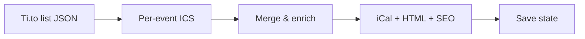

<p align="center">
  <strong>🚗 Tesla Owners UK Events Calendar</strong>
</p>
<p align="center">
  <em>iCalendar feed for Tesla Owners UK events: track days, meetups, AGMs, and more</em>
</p>

<p align="center">
  <a href="https://github.com/evenwebb/tesla-owners-club-uk-events-calendar/blob/main/LICENSE"></a>
  <a href="https://www.python.org/downloads/"></a>
  <a href="https://github.com/evenwebb/tesla-owners-club-uk-events-calendar"></a>
</p>

<p align="center">
  <a href="https://evenwebb.github.io/tesla-owners-club-uk-events-calendar/"><strong>📅 Subscribe to the calendar →</strong></a>
</p>

> **Just want the events?** Visit the link above to add Tesla Owners UK events to Google Calendar, Apple Calendar, or Outlook. No code required: one click to subscribe.

---

## 📋 Table of Contents

- [Subscribe (no code)](#-subscribe-to-the-calendar)
- [Quick Start](#-quick-start)
- [Features](#-features)
- [Installation](#-installation)
- [Usage](#-usage)
- [GitHub Actions](#-github-actions)
- [Configuration](#-configuration)
- [How It Works](#-how-it-works)
- [Example Output](#-example-output)
- [License & Disclaimer](#-license--disclaimer)

---

## 📅 Subscribe to the Calendar

**Add Tesla Owners UK events to your calendar: no installation, no code.**

| Calendar | How to add |
|----------|------------|
| **Google Calendar** | [Open the calendar page](https://evenwebb.github.io/tesla-owners-club-uk-events-calendar/), click **Subscribe to calendar**, or add via *Add other calendars → From URL* |
| **Apple Calendar** | [Open the calendar page](https://evenwebb.github.io/tesla-owners-club-uk-events-calendar/), click the link, or use *File → New Calendar Subscription* |
| **Outlook** | [Open the calendar page](https://evenwebb.github.io/tesla-owners-club-uk-events-calendar/) and click subscribe, or use *Add calendar → Subscribe from web* |

**Direct calendar URL:** `https://evenwebb.github.io/tesla-owners-club-uk-events-calendar/tocuk.ics`

---

## ⚡ Quick Start (for developers)

```bash
git clone https://github.com/evenwebb/tesla-owners-club-uk-events-calendar.git
cd tesla-owners-club-uk-events-calendar
pip install -r requirements.txt
python tocuk_scraper.py
```

Output is written to `docs/`. For a hosted calendar, see [Subscribe to the Calendar](#-subscribe-to-the-calendar) above.

---

## ✨ Features

| Feature | Description |
|--------|-------------|
| 📅 **Event data** | Title, description, location, start/end (from Ti.to ICS), banner image (from Ti.to list JSON) |
| 🌍 **Timezone-aware** | Ti.to floating times interpreted as Europe/London; iCal emitted in UTC (`Z`) |
| 📍 **RFC 5545 iCal** | UID from Ti.to, `SEQUENCE`/`DTSTAMP` persistence, `STATUS:CANCELLED` + `CANCELLED:` summary when needed |
| 📜 **Archive** | Past events on `archive.html`; subscribe feed is **upcoming-only** |
| ⚡ **Resilient fetch** | Retries on HTTP errors; optional local detail cache when developing |
| 🔄 **Sources** | List: `checkout.tito.io/teslaownersuk.json`; detail: per-event `?format=ics` |
| 🔔 **Reminders** | Off by default (`NOTIFICATIONS.enabled = False`); no `VALARM` in the feed |

---

## 📦 Installation

**Requirements:** Python 3.10+, `requests`

```bash
pip install -r requirements.txt
```

---

## 🚀 Usage

From the repository root:

```bash
python tocuk_scraper.py
```

The script will:

1. Fetch the [Ti.to checkout JSON](https://checkout.tito.io/teslaownersuk.json) for Tesla Owners UK (`teslaownersuk`)
2. For each event, fetch [per-event ICS](https://checkout.tito.io/teslaownersuk/) (`…/{slug}?format=ics`) for accurate times and text fields
3. Merge list + ICS, then write `docs/tocuk.ics`, `docs/index.html`, `docs/archive.html`, `sitemap.xml`, `robots.txt`
4. Print a summary of events

> **Note:** Errors are logged to `tocuk_log.txt`.

---

## 🤖 GitHub Actions

The workflow runs **weekly on Mondays at 09:00 UTC** and can be triggered manually from the **Actions** tab.

| Step | Description |
|------|-------------|
| 1 | Checkout, set up Python (with pip cache) |
| 2 | Run scraper (retries once on failure) |
| 3 | Commit and push `docs/` if changed |

Each run performs a **full refresh** (list + ICS per event) so cancellations and schedule changes always reach subscribers. State files (`docs/.ical_sequence.json`, `docs/.last_upcoming.json`) are still written for diagnostics and future use.

### GitHub Pages

1. Go to **Settings → Pages**
2. **Deploy from a branch** → branch **main** → folder **/docs**
3. Your calendar will be at `https://<username>.github.io/tesla-owners-club-uk-events-calendar/`

**Live calendar:** [evenwebb.github.io/tesla-owners-club-uk-events-calendar](https://evenwebb.github.io/tesla-owners-club-uk-events-calendar/)

---

## ⚙️ Configuration

### Notifications

Enable calendar reminders in `tocuk_scraper.py`:

```python
NOTIFICATIONS = {
    "enabled": True,
    "alarms": [
        {"days_before": 1, "description": "Event tomorrow"},
        {"days_before": 0, "description": "Event today"}
    ]
}
```

### Other options

| Variable | Default | Purpose |
|---------|--------|---------|
| `CACHE_EXPIRY_DAYS` | 7 | How long to cache event details |
| `FETCH_DELAY_SEC` | 0.5 | Delay between detail page requests |
| `CALENDAR_SITE_URL` | *(see `tocuk_scraper.py`)* | Public Pages base URL for Open Graph, `sitemap.xml`, and `robots.txt` (set when you fork to another `*.github.io` path) |

**Generated / state files in `docs/`:** `sitemap.xml`, `robots.txt`, `og-image.png`, `.nojekyll` (disables Jekyll on GitHub Pages), `.ical_sequence.json` (per-slug `SEQUENCE` + `DTSTAMP`), `.last_upcoming.json` (upcoming fingerprints), `.health_status.json` (last run summary).

---

## 🔧 How It Works


```mermaid
flowchart LR
    A[Ti.to list JSON] --> B[Per-event ICS]
    B --> C[Merge & enrich]
    C --> D[iCal + HTML + SEO]
    D --> E[Save state]
```

1. **List:** `GET https://checkout.tito.io/teslaownersuk.json` → slugs, titles, human dates, locations, `banner_url`, public URLs
2. **Detail:** `GET https://checkout.tito.io/teslaownersuk/{slug}?format=ics` → `DTSTART`/`DTEND`, description, location, UID, cancellation, organizer, optional `GEO`
3. **Generate:** RFC 5545 calendar (**upcoming only** in the `.ics`), `index.html`, `archive.html`, JSON-LD
4. **Save:** Commits `docs/` from Actions when outputs change

---

## 📄 Example Output

```
✓ Created docs/ with tocuk.ics (7 events), index.html, and archive.html

  • Giga Texas 2026, 16 March 2026 11:30 @ Austin, Texas
  • Annual General Meeting, 28 March 2026 10:30 @ Online
  • Everything Electric - North, 08 May 2026 10:00 @ Yorkshire Event Centre
  ...
```

---

## 📜 License & Disclaimer

This project is licensed under the **GPL-3.0** License; see the [LICENSE](LICENSE) file for details.

> **Disclaimer:** This is a fan-made project. Not affiliated with Tesla Owners UK Limited. Event data is taken from Ti.to’s public JSON and ICS endpoints; use subject to [Ti.to](https://ti.to/)’s terms.

---

<p align="center">
  <a href="https://ti.to/teslaownersuk">Tesla Owners UK on Ti.to</a> ·
  <a href="https://github.com/evenwebb/tesla-owners-club-uk-events-calendar">Source</a> ·
  <a href="https://github.com/evenwebb">evenwebb</a>
</p>
